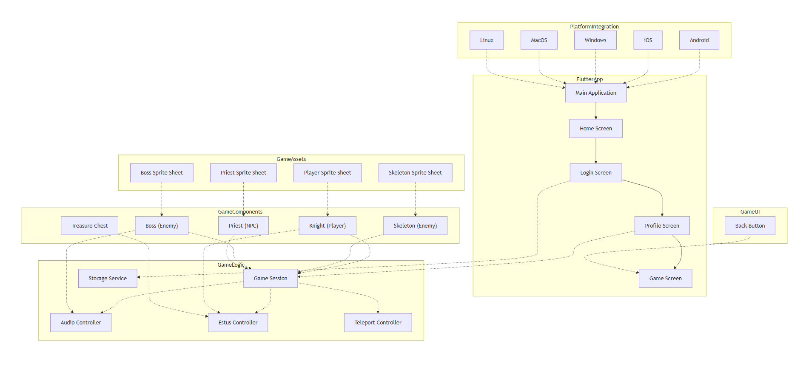

# Dark Souls Pixel Adventure

Un jeu d’action-aventure 2D en pixel art, développé avec Flutter et le moteur Bonfire.
Explore des donjons mystérieux, affronte des ennemis, utilise tes fioles d’Estus pour survivre et affronte un boss final épique.

# Fonctionnalités principales

- Pixel Art style Dark Fantasy

- Système de combat

- Attaque de mêlée 🗡️

- Attaque à distance 🔥

- Utilisation de fioles d’Estus

- Dialogues immersifs

- Téléportation

- Musiques intégrées

- Maps interconnectées

- Système de téléportation type Fog Gate

- PNJ & Ennemis

- Squelettes

- Boss final

# Structure du projet :

# Installation & lancement

🔧 Prérequis

- Flutter 3.35

- Dart 3.9.2

- Un émulateur ou un appareil physique

# Cloner & installer

## 1. Cloner le dépôt
`git clone https://github.com/tristan-goncalves/rpg-project-dark-souls`

## 2. Aller dans le dossier
`cd rpg-project-dark-souls`

## 3. Installer les dépendances
`flutter pub get`

## 4. Lancer le jeu
`flutter run`

# Technologies utilisées
- Flutter

- Bonfire 3.10.1

- Flame (FlameAudio)

- Tiled (éditeur de maps)

- Dart